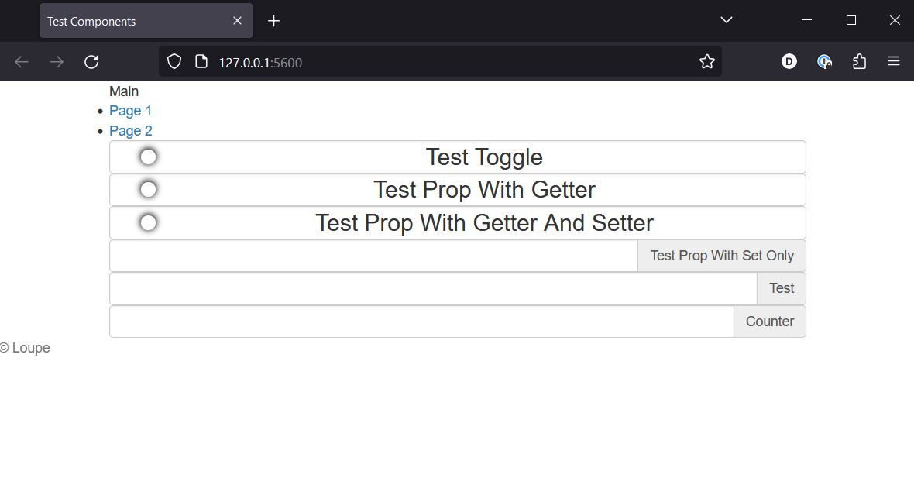

# Test Loupe UX

## Install npm dependencies

1. If not installed, install [npm](https://nodejs.org/en/download/).

2. Change Directory to where the the `package.json` is located and run the install command

```
cd ./example/HMI/
npm install
```

## Change the connection settings

Open the file `public/src/app.js` and change the connection settings

```javascript
machine = new LUX.Machine({
  port: 8000, // "Port of the server"
  ipAddress: "127.0.0.1", // "IP address of the server"
  maxReconnectCount: 5000,
});
```

## Run

Open Index.html with your favorite server.

Option 1: Run the following command to start a local server

```
npm start
```

Option 2: The [Live Server](https://marketplace.visualstudio.com/items?itemName=ritwickdey.LiveServer) extension for VSCode is recommended. Once installed, right click on `index.html` and select `Open with Live Server`.

The client should display in a browser:

